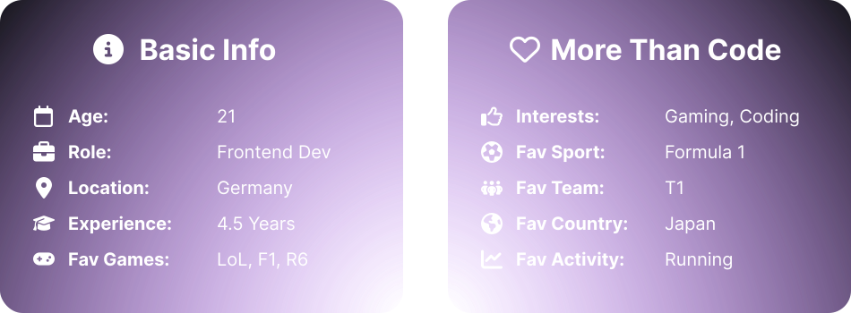
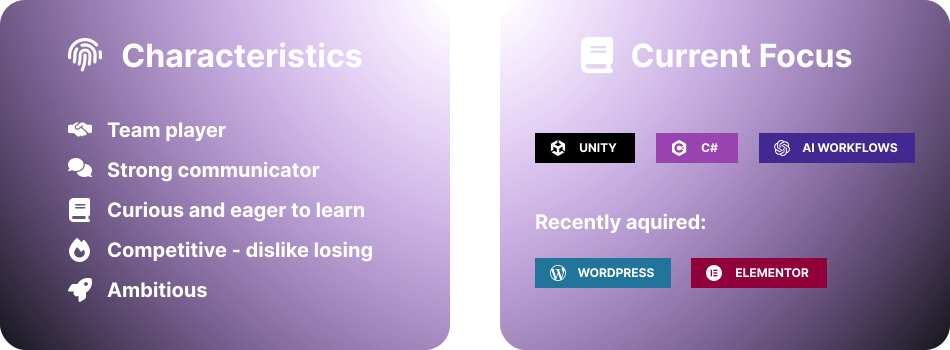
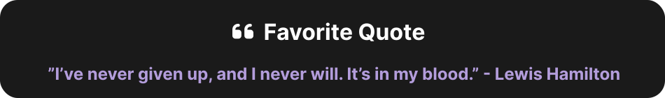
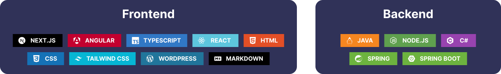
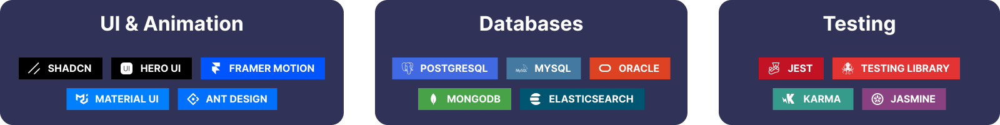
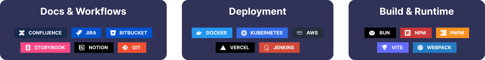
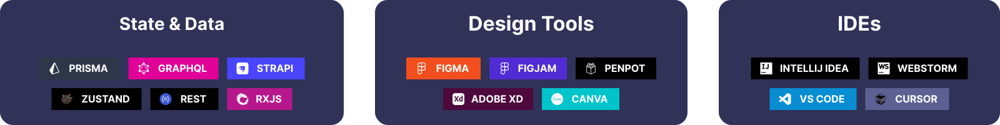

  

  
  
  
  
  
  

 

    

## 👤 About Me

  
  &nbsp;&nbsp;&nbsp;
  
  &nbsp;&nbsp;&nbsp;
  

 

## 📊 GitHub Stats & Activity

  
&nbsp;&nbsp;&nbsp;
  

&nbsp;&nbsp;&nbsp;

  
  

&nbsp;&nbsp;&nbsp;

  

 

## 🚀 Technologies & Tools

  
  &nbsp;&nbsp;&nbsp;
  
  &nbsp;&nbsp;&nbsp;
  
  &nbsp;&nbsp;&nbsp;
  

 

## 🤝 Let's Connect

  
  

  &nbsp;&nbsp;&nbsp;

  

 &nbsp;&nbsp;&nbsp;

> _(Note: This README was fully written and styled by me - originally with advanced HTML / CSS. If you have any Questions, feel  free to contact me.)_