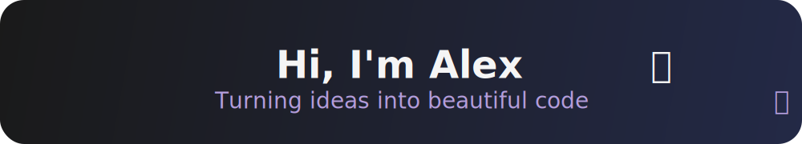

  

  
  
  
   
   

 

  

 

## 👤 About Me

  

    <h3 align="center" style="margin-top: 0;">📄 Basic Info</h3>
    <ul style="list-style: none; padding: 0; margin: 0; text-align: left;">
      <li>👤 <b>Age:</b> 21</li>
      <li>💻 <b>Role:</b> Frontend Developer</li>
      <li>🌍 <b>Location:</b> Germany</li>
      <li>🕒 <b>Experience:</b> 4,5 Years</li>
      <li>🕹️ <b>Favorite Games:</b> LoL, F1, R6</li>
    </ul>
  

  

    <h3 align="center" style="margin-top: 0;">🎯 Hobbies & Interests</h3>
    <ul style="list-style: none; padding: 0; margin: 0; text-align: left;">
      <li>🎮 <b>Interests:</b> Gaming, Coding, Writing</li>
      <li>🏎️ <b>Favorite Sport:</b> Formula 1</li>
      <li>🏆 <b>Favorite Team:</b> T1</li>
      <li>🗾 <b>Favorite Country:</b> Japan</li>
      <li>🏃 <b>Activity:</b> Running, walking outdoors</li>
    </ul>
  

  

    <h3 align="center" style="margin-top: 0;">🧠 Characteristics</h3>
    <ul style="list-style: none; padding: 0; margin: 0; text-align: left;">
      <li>🤝 <b>Team player</b></li>
      <li>💬 <b>Strong communicator</b></li>
      <li>🔎 <b>Curious and eager to learn</b></li>
      <li>🔥 <b>Competitive – dislike losing</b></li>
      <li>🚀 <b>Ambitious</b></li>
    </ul>
  

  

    <h3 align="center" style="margin-top: 0;">📚 Currently Learning</h3>
    

      
      
      
    

    

      <h4 style="margin: 0; text-align: left;">Recently Learned:</h4>
      

        
        
      

    

  

  

    "I've never given up, and I never will. It's in my blood." – Lewis Hamilton
  

 

## 📊 GitHub Stats & Activity

<table width="90%" style="border: none;">
  <tr>
    <td width="50%" style="border: none;">
      
    </td>
    <td width="50%" style="border: none;">
      
    </td>
  </tr>
  <tr>
    <td width="50%" style="border: none;">
      
    </td>
    <td width="50%" style="border: none;">
      
    </td>
  </tr>
</table>

 

## 🚀 Technologies & Tools

  

    <h3 align="center" style="margin-top: 0;">Frontend</h3>
    
    
    
    
    
    
    
  

  

    <h3 align="center" style="margin-top: 0;">Backend</h3>
    
    
  

  

    <h3 align="center" style="margin-top: 0;">DevOps & Tools</h3>
    
    
    
  

  

    <h3 align="center" style="margin-top: 0;">Databases</h3>
    
    
    
  

  

    <h3 align="center" style="margin-top: 0;">IDEs</h3>
    
    
  

 

## 🤝 Let's Connect

  
  

  

    
    alexjaloleyy
  

